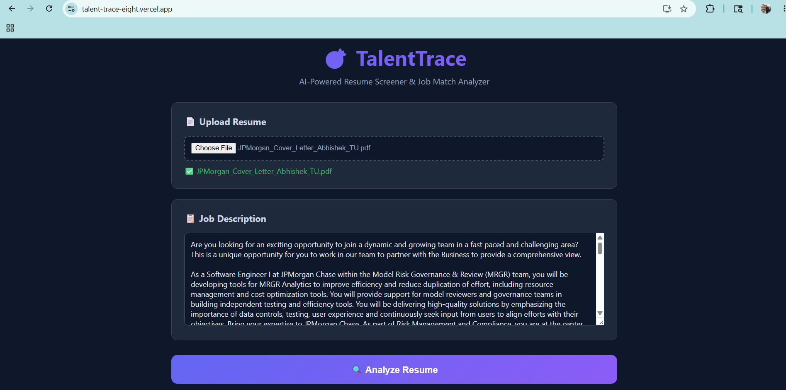
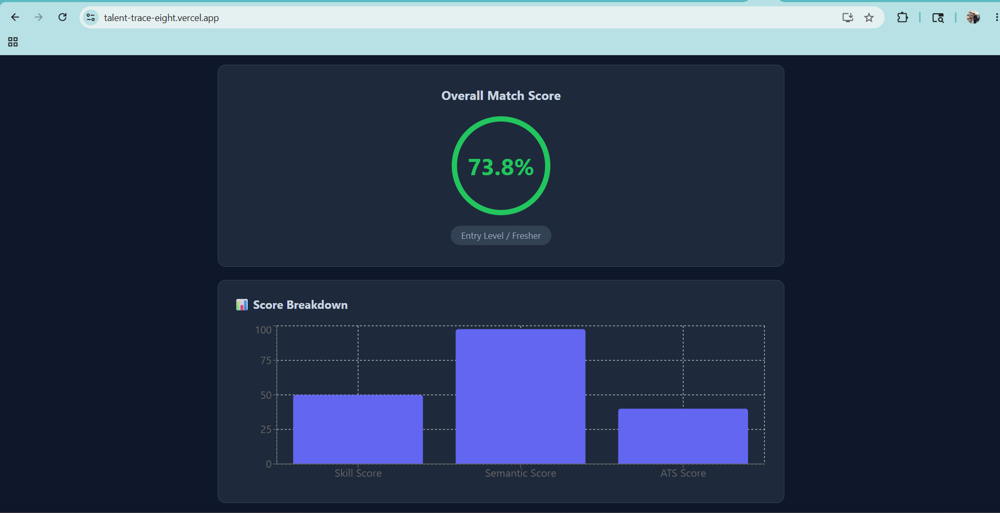
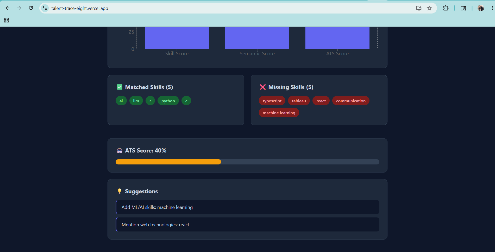

# TalentTrace 🎯
AI-Powered Resume Screener & Job Match App

## Tech Stack
- Backend: Python, FastAPI
- NLP: spaCy, sentence-transformers (Week 2)
- Frontend: React + Tailwind CSS (Week 4)

## Features (In Progress)
- [x] PDF resume upload and text extraction
- [x] NLP skill extraction
- [x] Resume vs Job Description matching
- [x] Skill gap analysis and suggestions
- [x] React dashboard
- [ ] Deploy to Render + Vercel

## Run Locally
cd backend
uvicorn main:app --reload
Visit http://localhost:8000/docs

## Live Demo
- Frontend: https://talent-trace-eight.vercel.app
- Backend API: https://talenttrace-y5x2.onrender.com/docs

## Screenshots

### Upload Page

### Results Dashboard

### Skill Analysis
