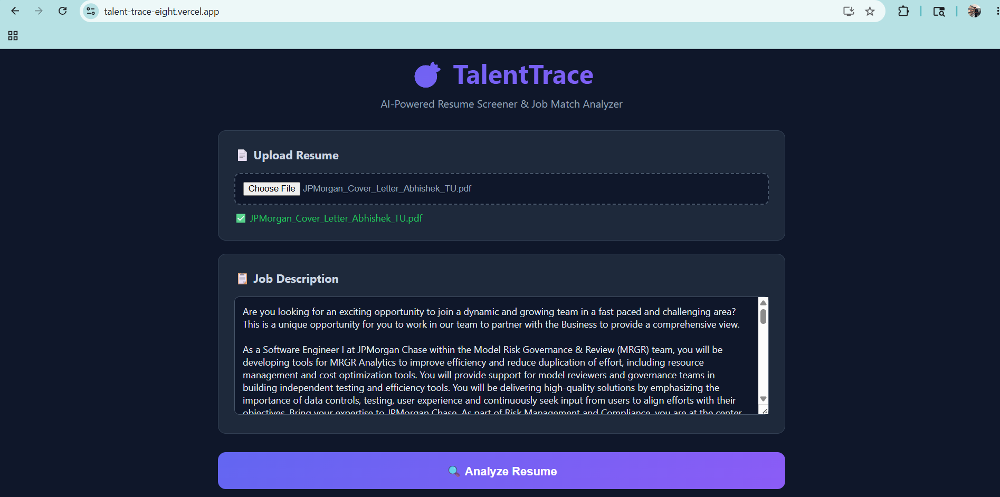
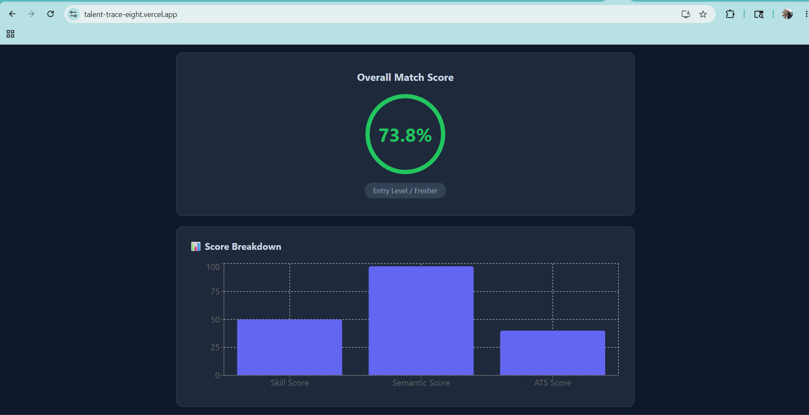
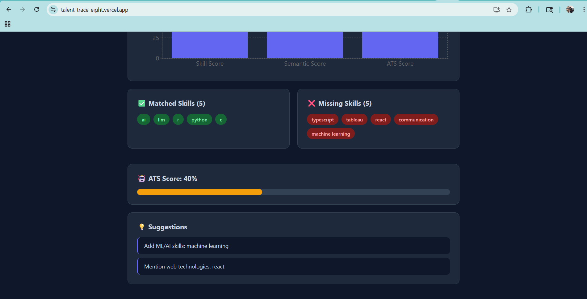

# TalentTrace 🎯

AI-powered resume screener and job match analyzer built with Python, FastAPI, spaCy, and React. TalentTrace analyzes a resume against a job description and returns a match score, skill gap analysis, ATS compatibility score, and personalized improvement suggestions — helping job seekers tailor their resumes before applying.

## Problem

Applicant Tracking Systems (ATS) filter out a large share of resumes before a human ever sees them, often over simple keyword or formatting mismatches. Most job seekers have no visibility into why they were rejected. TalentTrace closes that gap — it parses a resume and job description, quantifies the match, and tells the user exactly which skills are missing and how to close them.

## Demo

- **Frontend:** https://talent-trace-eight.vercel.app
- **Backend API docs:** https://talenttrace-y5x2.onrender.com/docs

## Screenshots

### Upload Page


### Results Dashboard


### Skill Analysis


## How It Works
1. User uploads a resume (PDF) and pastes a target job description.
2. Backend extracts raw text from the PDF and runs NLP-based skill extraction using spaCy.
3. Resume and job description are compared using spaCy word vectors to produce a semantic similarity score.
4. A skill-gap layer diffs extracted resume skills against job-required skills.
5. Results — match score, ATS compatibility score, missing skills, and improvement suggestions — are returned to the React dashboard.

## Architecture

```
User (Browser)
      │
      ▼
React Frontend (Vercel)
      │  Upload PDF + Job Description
      ▼
FastAPI Backend (Render)
      │
      ├── pdfplumber → Extract text from PDF
      │
      ├── spaCy → Skill extraction + Semantic similarity
      │
      ├── Skill Gap Analysis → Matched vs Missing skills
      │
      └── ATS Scorer → Keyword + formatting checks
              │
              ▼
        JSON Response
              │
              ▼
React Dashboard → Match Score + Charts + Suggestions
```

## Tech Stack

| Layer | Tools |
|---|---|
| Backend | Python, FastAPI |
| NLP | spaCy, sentence-transformers |
| Frontend | React, Tailwind CSS |
| Deployment | Render (backend), Vercel (frontend) |

## Features

- PDF resume upload and text extraction
- NLP-based skill extraction
- Resume vs. job description semantic matching
- Skill gap analysis with actionable suggestions
- ATS compatibility scoring
- React dashboard for results visualization

## Run Locally

### Backend
```bash
cd backend
uvicorn main:app --reload
```

Visit http://localhost:8000/docs

### Frontend
```bash
cd frontend/talenttrace-ui
npm install
npm start
```
Visit http://localhost:3000

## Limitations & Future Work

- Skill matching relies on extracted keywords/entities; may miss semantically equivalent skills phrased differently
- No support yet for non-English resumes
- Planned: multi-resume batch comparison, resume rewriting suggestions powered by an LLM

<!-- Add a LICENSE file (MIT is a common default) and badge here -->

---
